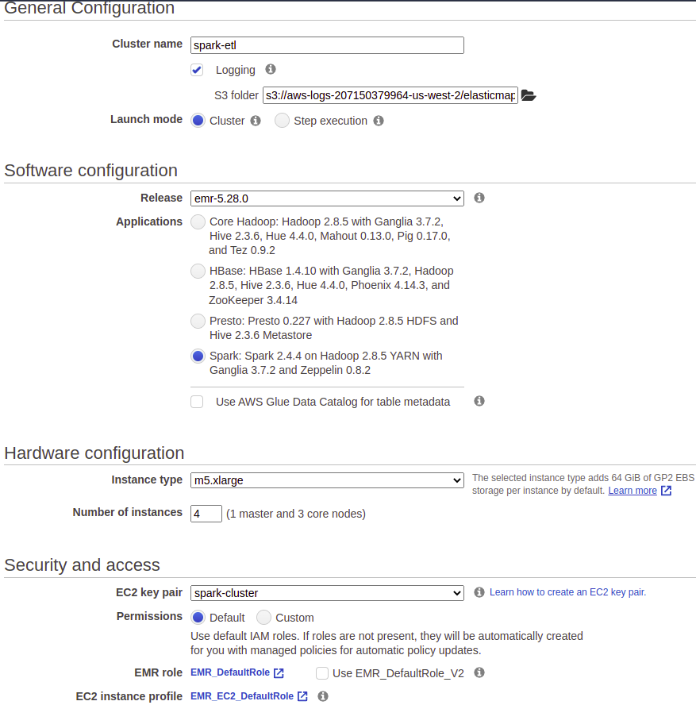
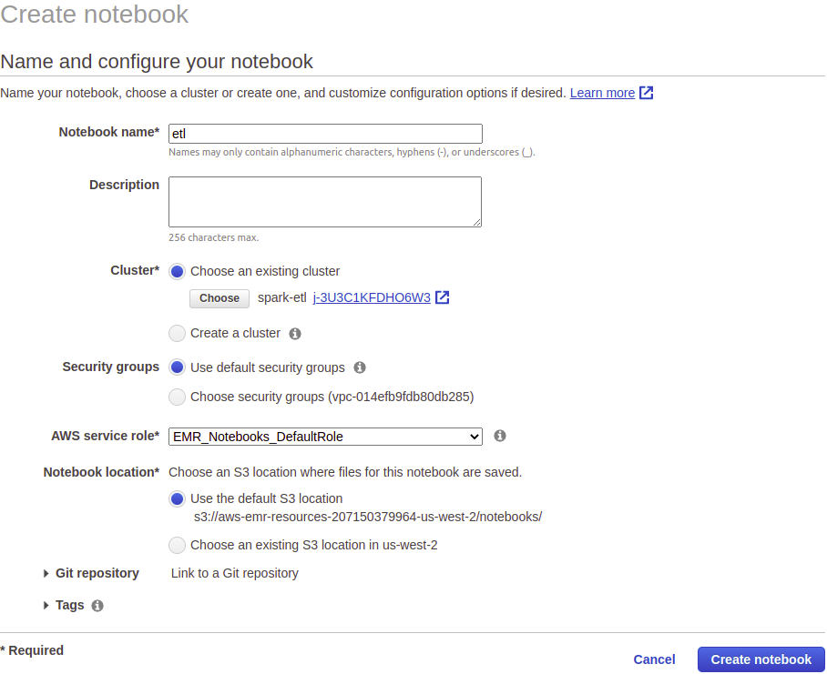
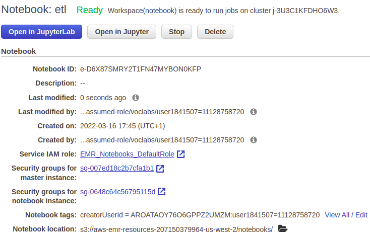
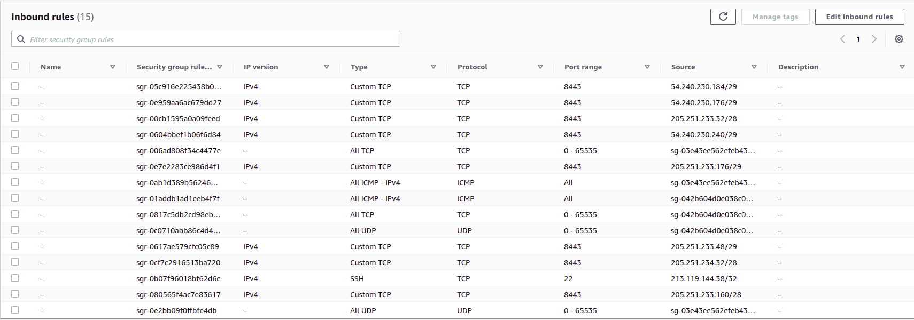
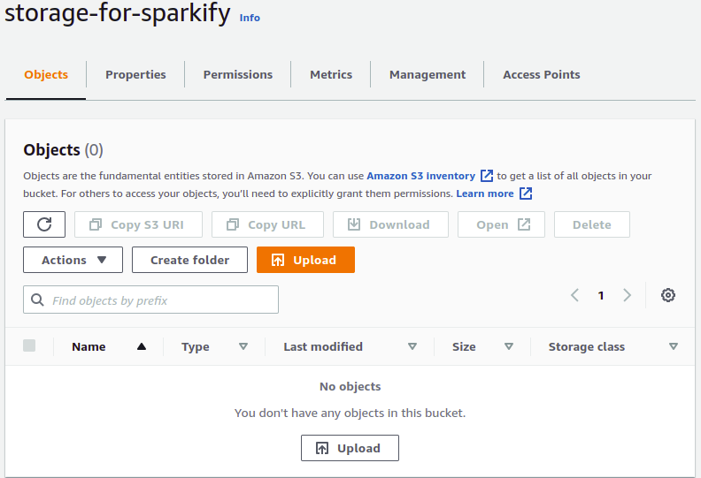
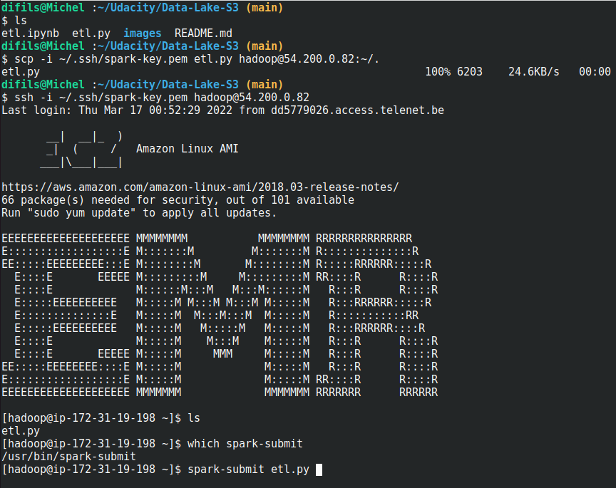
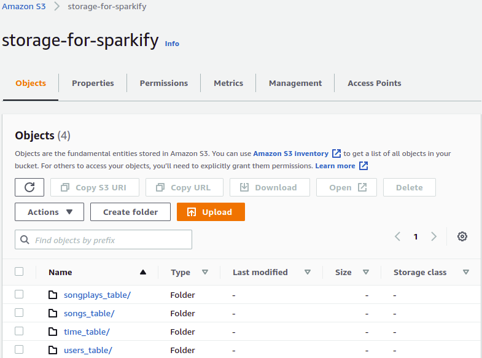

# Data lake using S3 bucket

## Introduction

A music streaming startup, Sparkify, has grown their user base and song database
even more and want to move their data warehouse to a data lake. Their data resides
in S3, in a directory of JSON logs on user activity on the app, as well as a
directory with JSON metadata on the songs in their app.

My task as data engineer, is to build an ETL pipeline that extracts their data
from S3, processes them using Spark, and loads the data back into S3 as a set of
dimensional tables. This will allow their analytics team to continue finding
insights in what songs their users are listening to.

## AWS EMR cluster

Installing and configuring spark is not easy. That why I'll leverage the power
of amazon ElasticMapReduce. Go to AWS management console and search for EMR
service. Then click on `create cluster` and configure the cluster as follow:

When the cluster is running or in a waiting status. Click on `notebook`
(left side) and then click on `create notebook` blue button:

Click on `Open in JupyterLab` button when the notebook is ready:

## ETL pipeline

Open the `etl.ipynb` to see the pipeline process.

## RUN `etl.py`

Make sure to allow ssh connection in the master node security group:

Make sure to update `output_data` inside `etl.py` file with your own private s3 bucket
path. **Otherwise the script will through an error while trying to save data into
parquet files inside S3**.

Make sure you know where your key-pair.pem used for EMR cluster is located.
Download the `etl.py` file on your local machine and copy it into EMR cluster.  
`scp -i /path/to/key-pair.pem Download/etl.py hadoop@<master-node-public-IP>:~/.`

SSH into your EMR cluster:
`ssh -i /path/to/key-pair.pem hadoop@<master-node-public-IP>`

Check that `etl.py` has been successfully copied then submit

**Notice:**  
This may take up to 15 minutes to complete (depending on the number of spark workers).

After it's done, the bucket should look like below:

